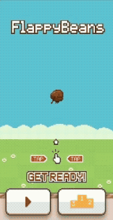

  

<h1 align="center"> 
Flappy Beans JS
</h1>

  <em>Flappy Bird, but with beans.</em>

  

---

## Gameplay

  

---

## Overview
A **Flappy Bird–like** browser game implemented using **JavaScript**, **HTML** and **CSS**, featuring custom "Flappy Beans" sprites and sound effects.

**Sprites** were sourced from [user 1UP.capsule on OpenGameArt.org](https://opengameart.org/content/flappy-beans).  
**Audio** was obtained from the repository ["flappy-bird-assets" by samuelcust](https://github.com/samuelcust/flappy-bird-assets.git).
